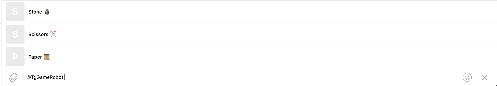
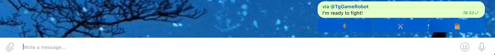

# tg-game-bot

### Configuration:
* add the bot to your telegram supergroup (maybe you should convert the group to public)
* make the bot as an admin
* turn on the Inline Mode to the bot (Bot Settings in the Bot Father)
* run the bot with Environment variable BOT_TOKEN="your bot's API Token"

### Dependencies:
* Java Telegram Bot API https://github.com/pengrad/java-telegram-bot-api

### Screenshots:
1. call the bot by @bot-name and 1st player make your choice throw inline keyboard

2. 2nd player don't know 1st player's bet and make his own choice

3. the bot shows results

